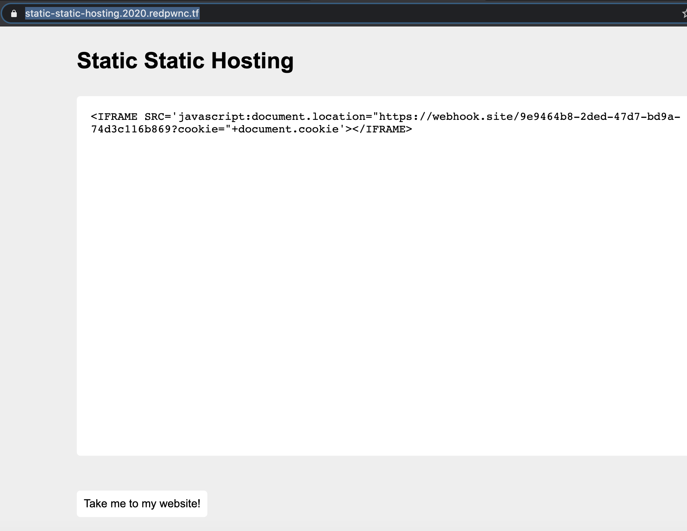
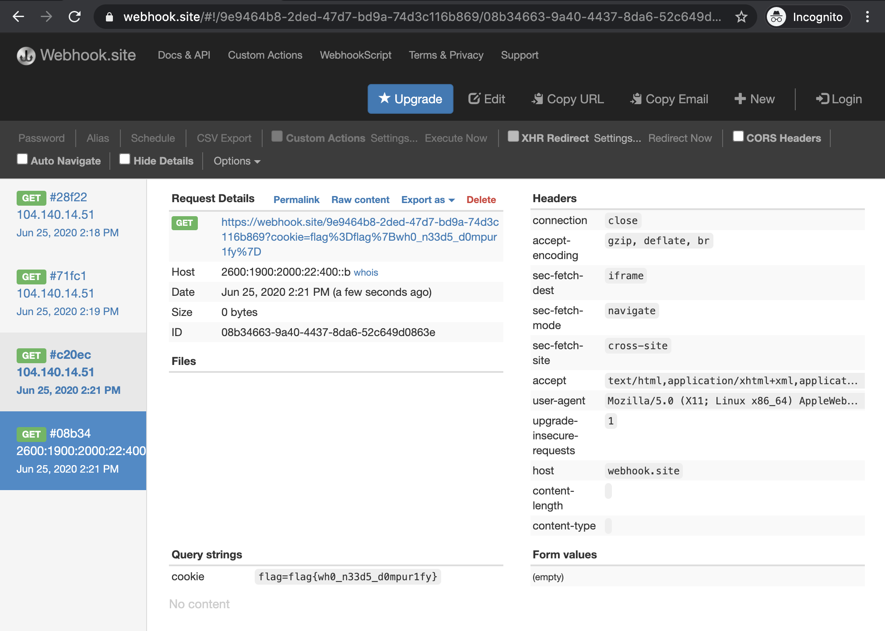

### Challenge

```
web/static-static-hosting
BrownieInMotion

Seeing that my last website was a success, I made a version where instead of storing text, you can make your own custom websites! If you make something cool, send it to me here

Site: static-static-hosting.2020.redpwnc.tf
```

### Recon

* We need to bypass the sanitization and follow the similar steps as the static paste bin challenge

```
(async () => {
    await new Promise((resolve) => {
        window.addEventListener('load', resolve);
    });

    const content = window.location.hash.substring(1);
    display(atob(content));
})();

function display(input) {
    document.documentElement.innerHTML = clean(input);
}

function clean(input) {
    const template = document.createElement('template');
    const html = document.createElement('html');
    template.content.appendChild(html);
    html.innerHTML = input;

    sanitize(html);

    const result = html.innerHTML;
    return result;
}

function sanitize(element) {
    const attributes = element.getAttributeNames();
    for (let i = 0; i < attributes.length; i++) {
        // Let people add images and styles
        if (!['src', 'width', 'height', 'alt', 'class'].includes(attributes[i])) {
            element.removeAttribute(attributes[i]);
        }
    }

    const children = element.children;
    for (let i = 0; i < children.length; i++) {
        if (children[i].nodeName === 'SCRIPT') {
            element.removeChild(children[i]);
            i --;
        } else {
            sanitize(children[i]);
        }
    }
}

```

### Solve

* Some attempts
  - Tried a bunch of payloads as shown in script.js
  - First break through was with `EMBED SRC` to fetch a javascript from a hosted server
    - It kind of worked but the cookie cannot be retrieved with the `data` urls according to chrome
    - So the payload did not work!
  - IFRAME SRC was next with javascript protocol and it worked!
* Checkout script.js for different payloads attempted.



