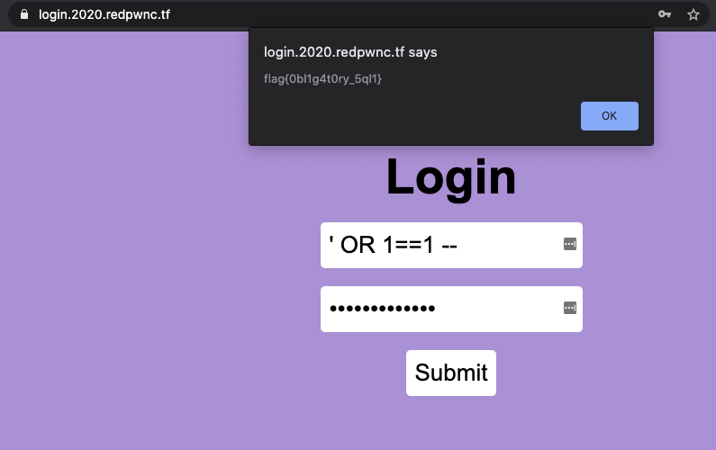

### Challenge
```
web/login
BrownieInMotion

I made a cool login page. I bet you can't get in!

Site: login.2020.redpwnc.tf
```

### Recon
* The JS file is present in the folder that contains the flow.
* Obvious SQL inject?
* Based on the flow in the JS file, just bypassing the query returns the flag env variable.

### Solve
* `' OR 1==1 --` passes the sql and returns the flag

